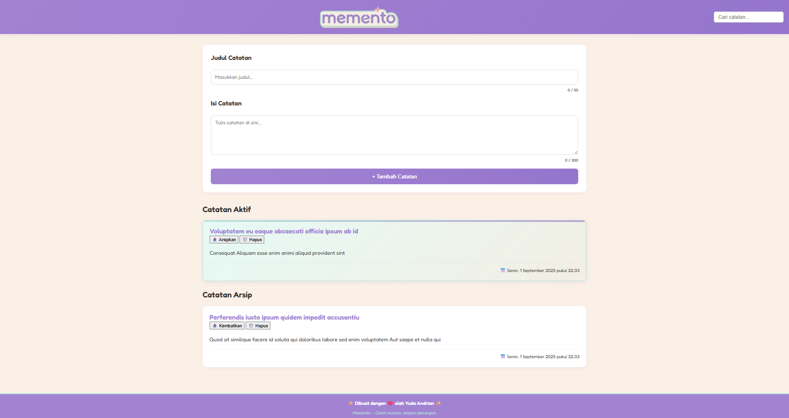

# 📝 Memento v2 - Notes App

**Memento v2** adalah aplikasi catatan sederhana, imut, dan estetik untuk menyimpan ide, momen berharga, dan rencana sehari-hari.  
Dibangun dengan **HTML, CSS, dan JavaScript (Web Components)** untuk pengalaman yang ringan dan interaktif.

✨ _“Memento — Catat momen, simpang kenangan.”_

📚 Project ini dibuat sebagai **submission Dicoding** untuk kelas  
**Belajar Fundamental Front-End Web Development**.

---

## 🚀 Fitur Baru v2

- 📒 Tambah catatan baru dengan **judul dan isi** secara cepat
- 🎨 Tampilan pastel estetik (ungu, mint, cream, pink)
- 🗂️ Catatan tersusun rapi dalam **grid responsif**
- ⭐ Highlight catatan penting
- 🔍 **Search bar** untuk menemukan catatan dengan cepat
- 📱 **Responsive design** untuk desktop & mobile
- ❤️ Made with love by **Yuda Andrian**

---

## 🛠️ Tech Stack

- **HTML5**
- **CSS3** (Custom properties & Google Fonts)
- **JavaScript (ES6 Modules + Web Components)**

---

## 📸 Preview

---

## 💡 Catatan

Memento v2 meningkatkan **user experience** dengan:
- Navigasi lebih mudah
- Logo di tengah dan search bar di kanan
- Animasi halus untuk interaksi