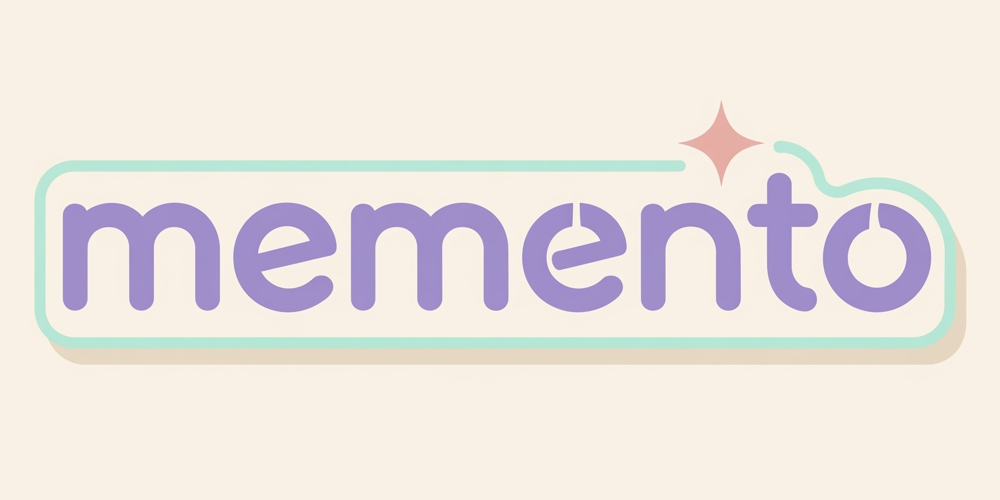
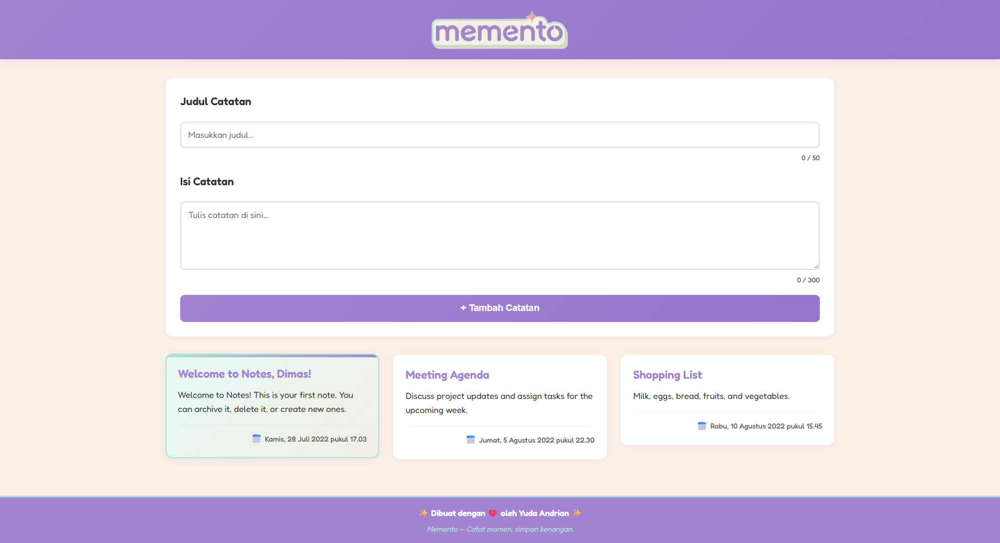

# 📝 Memento - Notes App

**Memento** adalah aplikasi catatan sederhana, imut, dan estetik untuk menyimpan ide, momen berharga, dan rencana sehari-hari.  
Dibuat dengan **HTML, CSS, dan JavaScript (Web Components)**.  

✨ *“Memento — Tulis hari ini, kenang selamanya.”*  

📚 Project ini dibuat untuk memenuhi kebutuhan **submission Dicoding** pada kelas  
**Belajar Fundamental Front-End Web Development**.

---

## 🚀 Fitur
- 📒 Tambah catatan baru dengan judul dan isi  
- 🎨 Tampilan pastel estetik (ungu, mint, cream, pink)  
- 🗂️ Catatan tersusun rapi dalam grid  
- ⭐ Highlight catatan penting  
- 📱 Responsive design (cocok untuk desktop & mobile)  
- ❤️ Dibuat dengan cinta oleh **Yuda Andrian**  

---

## 🛠️ Tech Stack
- **HTML5**
- **CSS3** (Custom properties & Google Fonts)
- **JavaScript (ES6 Modules + Web Components)**

---

## 📸 Preview

---